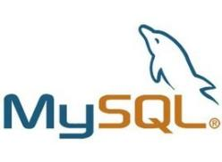
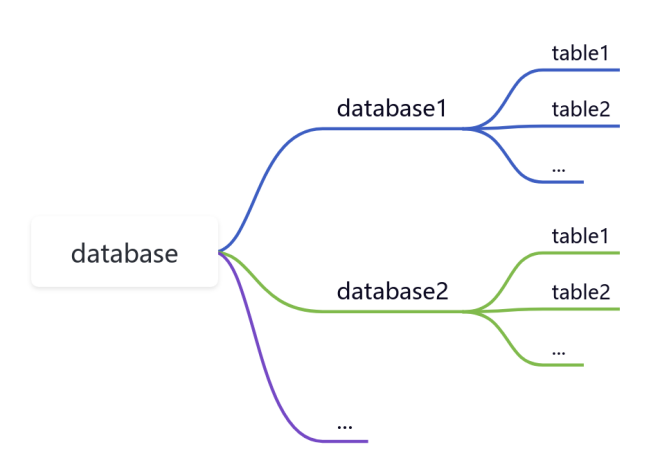

### MySQL 教程

---

#### 第一课——初识mysql

 

MySQL是一个流行的开源关系型数据库管理系统，由Michael Widenius等人于1994年创建。它在Web应用程序领域得到了广泛应用。MySQL的发展历程包括开源发布、持续发展、被Sun Microsystems和后来被Oracle收购。MySQL分为社区版和企业版，仍然是许多开发者和企业的首选数据库之一。在 WEB 应用方面 MySQL 是最好的 RDBMS(Relational Database Management System：关系数据库管理系统)应用软件之一。

在本教程中，会带大家大家快速掌握 MySQL 的基本知识，并轻松使用 MySQL 数据库。

---

什么是数据库？

数据库（Database）是按照数据结构来组织、存储和管理数据的仓库。

每个数据库都有一个或多个不同的 API 用于创建，访问，管理，搜索和复制所保存的数据。

我们也可以将数据存储在文件中，但是在文件中读写数据速度相对较慢。

所以，现在我们使用关系型数据库管理系统（RDBMS）来存储和管理大数据量。所谓的关系型数据库，是建立在关系模型基础上的数据库，借助于集合代数等数学概念和方法来处理数据库中的数据。

---

RDBMS 即关系数据库管理系统(Relational Database Management System)的特点：

1.数据以表格(table)的形式出现

2.每行为各种记录名称

3.每列(column)为记录名称所对应的数据域

4.许多的行和列组成一张表单(table)

5.若干的表单(table)组成数据库(database)

数据库管理系统基本关系如下图所示:

MySQL是一个关系型数据库管理系统（RDBMS），以下是一些常用术语的介绍：

1. 数据库（Database）：数据库是一组相关联的数据表的集合，用于存储和组织数据。

2. 数据表（Table）：数据表是数据库中的基本组成单位，它类似于电子表格，由行和列组成，用于存储特定类型的数据。

3. 列（Column）：列是数据表中的垂直部分，每一列包含相同类型的数据，例如，一个表中的列可以是姓名、年龄或者地址。

4. 行（Row）：行是数据表中的水平部分，也称为记录或元组，每一行代表一条特定的数据记录，例如，一个用户信息表中的一行可以包含一个用户的姓名、年龄和地址。

5. 主键（Primary Key）：主键是数据表中的唯一标识符，每个表只能有一个主键。主键的值在整个表中必须是唯一的，常用于查询、索引和关联其他表。

通过理解这些基本术语，可以更好地理解和操作MySQL数据库中的数据。MySQL是一个关系型数据库管理系统，它使用表格的概念来组织数据，一个数据库可以由一个或多个表格组成，每个表格都包含了若干列和行的数据。

